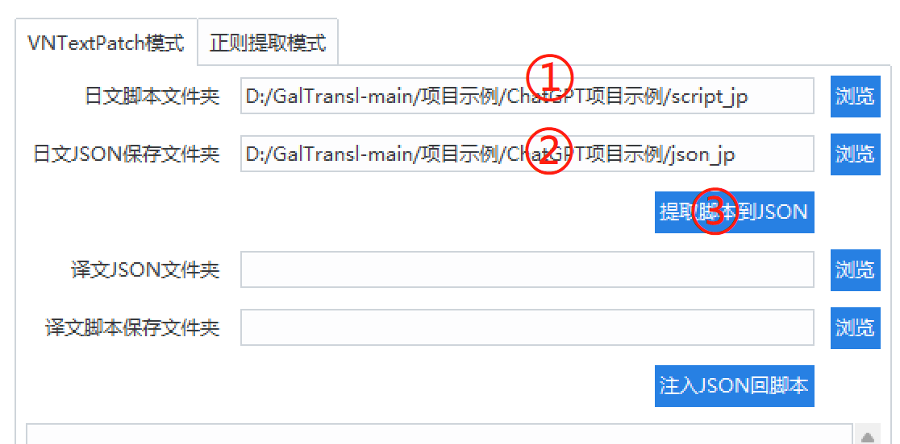

# GalTransl
  GalTransl是一套将数个基础功能上的微小创新与对ChatGPT提示工程（Prompt Engineering）的深度利用相结合的galgame自动化翻译工具包，用于制作内嵌式翻译补丁。   
   
  GalTransl的核心是一组由我(cx2333)构建的gal自动化翻译工具，它解决了使用ChatGPT自动化翻译GalGame过程中已知的大部分问题，并大幅提高了整体的翻译质量。同时，通过与其他项目的组合利用，打通了制作补丁的整个流程，一定程度的降低了上手门槛，从而让对此感兴趣的朋友有机会以较低的技术要求，构建具有一定质量的机翻补丁，并(或许)可以尝试在此基础上高效的构建更高质量的汉化补丁。  

  * 特性：   
  1. 支持ChatGPT、Newbing、GPT-4、彩云四种翻译引擎，并通过提示工程大幅提高了GPT引擎翻译质量   
  2. NewBing基于GPT-4并且免费；ChatGPT与GPT-4支持官方API与模拟网页操作模式，一定程度节省费用   
  3. NewBing、GPT-4引擎支持自动化校润；支持在翻译过程中自动记录翻译确信度、存疑句、未知专有名词，方便手工修正    
  4. 通过GPT字典系统让GPT了解人设，准确翻译人名、人称代词与生词   
  5. 通过译前、译后字典与条件字典实现灵活的自动化字典系统   
  6. 实时保存缓存、自动断点续翻   
  7. 结合其他项目支持多引擎脚本一键解包与注入，提供完整教程降低上手难度  

  * 交流群：https://t.me/+xCypZf4DXmJjYzdl （无Q群，有时间会回复）   

## 使用GalTransl翻译的游戏

* 《指尖连结/ゆびさきコネクション》 [链接](https://www.2dfan.com/downloads/16358)   
这是全网首个使用chatgpt翻译的galgame，使用了GalTransl的早期版本。  
翻译：主线NewBing翻译，hs使用GPT3.5翻译   

* 《炎孕女仆学院/もっと！孕ませ！炎のおっぱい異世界 おっぱいメイド学園！》 [链接](https://www.2dfan.com/downloads/16362)   
基本代表纯GPT3.5能达到的质量标准（角色太多了人名字典写了快50行🤣）   
翻译：全程GPT3.5   

* 《甜蜜女友2+/アマカノ2+》 [链接](https://www.2dfan.com/downloads/16596)   
这是首次将自动化校润用于gal翻译，基本可以代表GalTransl在未逐文本精修的前提下目前能达到的质量上限（但不代表GPT4的上限）。   
翻译：主线-我使用NewBing翻译+自动校润+部分手工修正；H翻-云忆夕使用GPT4   
美工：cx2333   

## 导航
* 环境准备：环境与软件的安装   
* 上手教程：全流程介绍如何制作一个机翻补丁，只想看怎么使用本工具的话，可以只看第2章   
* 翻译引擎介绍：本篇介绍各个翻译引擎的优缺点与推荐的组合   
* 翻译引擎调用：本篇详细介绍各个翻译引擎API的调用与配置方式。   
* GalTransl核心功能介绍：galtransl_core是整个系统的中枢，负责读写待翻译的json文件、实现缓存、字典、找问题等功能。  
* 结语：结语。   

## 环境准备
  * Python   
  安装最新版python即可。 [下载](https://www.python.org/downloads/)   
  安装时勾选下方add python to path   
   
  * [下载本项目]()   
  解压到任意位置，项目默认设置为D:\GalTransl-main   

  * Python依赖包   
  安装python后，打开cmd，通过以下命令使用pip安装python依赖库，或直接双击`upgrade_requirements.bat`

  ```cmd
  python -m pip install --upgrade -r requirements.txt -i https://pypi.tuna.tsinghua.edu.cn/simple/
  ```

  * EmEditor   
  神一样的文本编辑器。[下载](https://www.ghxi.com/emeditor.html)   
  
  * GARbro   
  神一样的解包工具。[下载](https://ghproxy.com/https://github.com/morkt/GARbro/releases/download/v1.5.44/GARbro-v1.5.44.2904.rar)   

## 上手教程
做一个gal内嵌翻译补丁的大致流程是：   
1. 识别引擎 -> 解包资源包拿到脚本 -> 接2.   
2. 解包脚本为日文文本 -> 翻译为中文文本 -> 构建中文脚本 -> 接3.   
3. 封包为资源包/免封包 -> 接4.
4. 引擎支持unicode的话，直接玩 -> 引擎是shift jis的，尝试2种路线使其支持显示中文   

我会分成以上4个模块分步讲解，这个段落为了让没做过的人也能有机会上手，会写的更照顾小白一些。   

* 建议先只跑开头一个文件的翻译，或先随便添加一些中文，导回游戏确认可以正常显示再全部翻译   
   
（点击展开详细说明）   
<details>

<summary> <b> 

### 第一章 识别与解包   
</b> </summary>
识别引擎其实很简单，通常来说，使用GARbro打开游戏目录内的任意资源包，在左下方的状态栏中就会显示引擎名称： 

或者，参考[资源包后缀表](https://morkt.github.io/GARbro/supported.html)，比较资源包的后缀。   

脚本一般在一些有明显关键字的资源包，或在资源包中明显关键字的目录内，例如：scene、scenario、message等字样。并且脚本通常是由许多明显分章节、分人物，有的还分出了主线和hs(例如带_h)，通常多翻找几个资源包就能找到。   

或者，参考[Dir-A佬的教程](https://space.bilibili.com/8144708/)   

特别的，针对新的krkrz引擎，GARbro已经无法打开资源包，可以用[KrkrzExtract项目](https://github.com/xmoezzz/KrkrzExtract/releases/tag/1.0.0.0)，将游戏拖到exe上启动。然后下一个全cg存档，直接把所有剧情ctrl一遍，也可以获取到脚本文件。   

</details>
<details>

<summary> <b> 

### 第二章 提取与翻译   
</b> </summary>
* **【2.1. 提取脚本文本】**   
&ensp;&ensp;&ensp;&ensp;通常情况下，本项目是结合[VNTextPatch工具](https://github.com/arcusmaximus/VNTranslationTools)来解包脚本的。 VNTextPatch是由外国大佬arcusmaximus开发的[支持许多引擎](https://github.com/arcusmaximus/VNTranslationTools#vntextpatch)脚本的提取与注入的通用工具。   
   
&ensp;&ensp;&ensp;&ensp;VNTextPatch是使用cmd操作的，为了降低上手难度，我搓了一个图形化的界面，你可以在项目的useful_tools/GalTransl_DumpInjector内找到，点击GalTransl_DumpInjector.exe运行。   
&ensp;&ensp;&ensp;&ensp;现在，你只需要选择日文脚本目录，然后选择保存提取的日文json的目录，这里一般将日文脚本放到叫script_jp的文件夹，再新建一个json_jp目录，用于存储提取出的脚本：   

&ensp;&ensp;&ensp;&ensp;在这里，需要明确一个概念：GalTransl全程是使用JSON格式输入、处理和输出的。[JSON是什么](http://c.biancheng.net/json/what-is-json.html)   
提取出来的json_jp文件打开是这个样子的：   
```json
[
  {
    "message": "わりと遠慮のない子らしい。でも、屈託のない明るさも\r\n相まってこういうのも悪くない。"
  },
  {
    "name": "咲來",
    "message": "「ってか、白鷺学園だったらあたしと一緒じゃん。\r\nセンパイだったんですねー」"
  }
]
```
&ensp;&ensp;&ensp;&ensp;其中，每个{}object(对象)是一句话，`message`是消息内容，如果object还带了`name`，说明是对话。不过可能并不是所有类型的脚本都可以带name提取，当可以带name时，GalTransl的翻译质量会更好。   
&ensp;&ensp;&ensp;&ensp;PS. GalTransl只支持指定格式的json文件输入，但并不是说GalTransl就与VNTextPatch工具绑定了，你完全可以通过其他工具提取出脚本文本，然后尝试使用"正则表达式模式"将其他格式的文本与json文本转换，但是需要一些正则经验。   

* **【2.2. GalTransl启动】**   
&ensp;&ensp;&ensp;&ensp;将本项目下载下来解压到任意位置（示例中默认为D盘根目录），在项目示例文件夹中，选择[你想使用的引擎](https://github.com/XD2333/GalTransl#翻译引擎介绍)的对应项目示例，然后建议把项目文件夹的名字改成游戏名。  
&ensp;&ensp;&ensp;&ensp;另外，项目示例里的`galtransl_core.py(核心程序)`和`xx_transl_api.py(翻译引擎)`不一定是最新的，建议在项目示例外找到这两个文件然后替换一下。   
&ensp;&ensp;&ensp;&ensp;这里用ChatGPT项目来举例。其他项目可参考下面[引擎使用]()章节，修改示例项目的project_setting(项目设置)即可调用。   
&ensp;&ensp;&ensp;&ensp;先将所有提取出的日文json文件放入`json_jp`文件夹中，然后编辑`project_setting.py`文件，修改以下内容：
```python
# 修改为这个项目所在文件夹的位置，注意Windows下斜杠要双写，用\\
project_dir = "D:\\GalTransl-main\\项目示例\\ChatGPT项目示例"
# 修改这个为通用字典目录位置
general_dic_dir = "D:\\GalTransl-main\\项目示例\\通用字典"
# 修改为你的api_key
openai_api_key = "sk-xxxxxxxxxxxxxxxxxxxxxxxxxxxxxxxxxxxx"
# 代理设置，有代理则设置为类似proxy_url="http://127.0.0.1:10809"，或者不填然后手动开启你的代理到全局模式
proxy_url = ""
```   
&ensp;&ensp;&ensp;&ensp;在这里需要一个openai的api key，以及需要魔法上网。如果你的魔法上网不稳定的话，可以尝试[自建openai api转发](https://github.com/noobnooc/noobnooc/discussions/9)。我建好了一个，免费给大家用(不一定总是可用，因为有免费限额，可能会被人滥用)，只需要再做如下修改：   
```python
# 调用openai api的URL，默认为官方地址，如果你有转发网站，把api.openai.com部分改为你的域名
openai_api_url = "https://openaiapi.cx2333.com"
# 代理设置(此时不要设置)
proxy_url = ""
```   
&ensp;&ensp;&ensp;&ensp;如果连api key也没有的话，你甚至还可以：   
* 使用[GPT-API-free项目](https://github.com/chatanywhere/GPT_API_free)，这是一个openai api的第三方代理，提供每小时120请求的**免费API**。   
* 或[openai-sb项目](https://openai-sb.com/)，这也是个代理项目，价格还算优惠，这不是推广，我也不担保它的稳定性。   
   
&ensp;&ensp;&ensp;&ensp;如果你使用类似项目的话，做以下额外的修改：   
```python
# 修改为你获得的第三方api_key
openai_api_key = "sk-xxxxxxxxxxx"
# 调用openai api的URL，默认为官方地址，如果你有转发网站，把api.openai.com部分改为你的域名
openai_api_url = "https://api.chatanywhere.cn" # 或https://api.openai-sb.com
# 代理设置(此时不要设置)
proxy_url = ""
```   
   
&ensp;&ensp;&ensp;&ensp;修改好项目设置后，理论上你只要在[当前项目文件夹打开cmd窗口](https://btfy.eu.org/?q=5aaC5L2V5Zyo5b2T5YmN5paH5Lu25aS55omT5byAY21k56qX5Y+j)，输入`python run_galtransl.py`，程序就会启动并开始翻译： 

&ensp;&ensp;&ensp;&ensp;**但是**，我不建议你就这样开始翻译了，你至少要先看一下[GPT字典的使用](https://github.com/XD2333/GalTransl#gpt字典)，为你要翻译的gal设定好各角色的人名字典，这样才能保证基本的质量。   

* **【2.3. 构建中文脚本】**   
&ensp;&ensp;&ensp;&ensp;如果你是使用GalTransl提取注入工具提取的脚本，构建同理，选择日文脚本目录、中文json目录、中文脚本保存目录，然后点'注入'，即可将文本注入回脚本。但这里面有一些坑，第四章会提到。

注：这里一般把中文脚本保存目录叫script_cn，因为日文脚本目录叫script_jp


</details>

<details>

<summary> <b> 

### 第三章 封包或免封   
</b> </summary>

&ensp;&ensp;&ensp;&ensp;构建好中文脚本后，下一步就是想办法让游戏读取。首先目前主流引擎基本都是支持免封包读取的，可以继续参考Dir-A佬的[教程](https://space.bilibili.com/8144708/)，看看你要搞的引擎支不支持免封包读取。   
&ensp;&ensp;&ensp;&ensp;特别的，针对krkr/krkrz引擎，可以使用arcusmaximus大佬的[KirikiriTools工具](https://github.com/arcusmaximus/KirikiriTools)，下载里面的version.dll，丢到游戏目录里，然后在游戏目录里新建一个"unencrypted"文件夹，将脚本丢进去，就可以让krkr读取   

</details>

<details>

<summary> <b> 

### 第四章 引擎与编码   
</b> </summary>

&ensp;&ensp;&ensp;&ensp;在这一章首先需要了解一下unicode、sjis(shift jis)、gbk编码的基础知识，为了偷懒在这里我还是放[Dir-A佬的文章](https://www.bilibili.com/read/cv12367744/)，如果你对这块不了解的话，先去读一下。   

如果你在做的引擎支持unicode编码，例如krkr、Artemis引擎等，一般就可以直接玩了。但如果引擎是使用sjis编码的话，直接打开会是乱码，这时候需要通过2种路线尝试使其可以正常显示中文：   

路线1：使用GBK编码注入脚本，然后修改引擎程序使其支持GBK编码   
路线2：仍然使用sjis编码注入脚本，但通过sjis隧道或sjis替换模式，结合通用注入dll在运行过程中通过动态替换来显示中文   

GalTransl提取注入工具的VNTextPatch模式注入脚本时默认是以sjis或unicode(utf8)编码注入的，这取决于脚本类型。

* **使用路线1**   
在注入前勾选"GBK编码注入"，在这个模式下所有GBK编码不支持的字符将被替换成空白，例如音符♪   
然后需要ollydbg或windbg工具，[在这里下载](https://down.52pojie.cn/Tools/Debuggers/)，用于修改引擎。   
最后还是去看[Dir-A佬的教程](https://space.bilibili.com/8144708/)，里面有教如何下断点、修改，完全没接触过逆向的话这可能很难，但没办法，照着视频多试试。   

* **使用路线2**   
在注入脚本时先什么都不勾，如果有提示"sjis_ext.bin包含文字：xxx"的话，说明程序是以sjis编码注入的，并把这些不支持显示的字符放到script_cn目录内的sjis_ext.bin里供sjis隧道模式调用了。   

**sjis隧道**：仍然来自arcusmaximus大佬的VNTranslationTools项目中的[VNTextProxy组件](https://github.com/arcusmaximus/VNTranslationTools#vntextproxy)。VNTextPatch在将文本注入回脚本时，会将sjis编码不支持的字符临时替换为sjis编码中未定义的字符，VNTextProxy通过DLL劫持技术HOOK游戏，并在遇到这些字符时再把它还原回去。   

当使用sjis隧道模式时，将`项目目录\script_cn`内的`sjis_ext.bin`文件移动到游戏目录内，然后将useful_tools\VNTextProxy内的所有dll逐个丢到游戏目录内(一般推荐先试version.dll，或使用PEID/DIE等工具查输入表)，运行游戏，看有没有哪个dll可以正确的hook游戏并让不显示的文本可以正常显示（不正常的话那些地方会是空的）。

**sjis替换**：来自AtomCrafty大佬的[UniversalInjectorFramework(通用注入框架)](https://github.com/AtomCrafty/UniversalInjectorFramework#character-substitution)项目，也是通过DLL劫持技术HOOK游戏，并可以将某个字符根据设置替换成指定的另一个字符，不限编码。我建立了一套替换字典，按一些规则梳理了sjis编码内不支持的简中汉字与sjis支持的汉字的映射关系，可以满足99.99%常用简体中文汉字的正常显示(见hanzi2kanji_table.txt)，并将替换功能写在了GalTransl提取注入工具内。在替换后结合sjis替换功能在游戏中将这些汉字替换回简中文字，实现游戏的正常显示。

当使用sjis替换模式时，可以先运行一遍GalTransl提取注入工具的注入文本，获取游戏不支持的文字列表（注入后会提示"sjis_ext.bin包含文字：xxx"），然后勾选"sjis替换模式注入"，把这些文字复制到右边的文本框内，再点击注入。注入后会获得一个sjis替换模式配置。打开useful_tools/UniversalInjectorFramework文件夹，里面也是很多dll，也是逐个尝试，一般推荐先试winmm.dll，把目录内的uif_config.json一并复制到游戏目录，然后编辑这个json，按GalTransl提取注入工具提供的配置填写`source_characters`和`target_characters`。然后运行游戏，如果游戏可以正常运行，并且弹出了一个像这样的控制台：

那多半就搞定了。
注：UniversalInjectorFramework也支持sjis隧道模式，可以设置`tunnel_decoder`为`True`然后在`mapping`里填入sjis_ext.bin包含文字。

</details>


## 翻译引擎介绍   
本篇介绍各个翻译引擎的优缺点与推荐的组合，本篇主要介绍引擎优缺点，具体使用见后面的章节。   

<details>
<summary> <b>【引擎详细介绍】（点击展开）</b> </summary>

* **NewBing**:+1::+1::+1:   
NewBing是微软的Bing ai助手，它[基于GPT-4](https://blogs.bing.com/search/march_2023/Confirmed-the-new-Bing-runs-on-OpenAI%E2%80%99s-GPT-4)，且不收费，是当你想创建高质量翻译时我的首推   
   
  * 优点：   
  ✔ **白嫖GPT-4**   
  ✔ 高质量的上下文分析与保持原文风格能力   
  ✔ 支持对每句翻译**自动给出翻译确信度**，方便人工校对   
  ✔ 在确信度低时，支持自动记录**它觉得存疑的片段**，方便人工校对   
  ✔ 支持自动记录**它不认识的专有名词**，方便人工校对   
  ✔ 支持对初翻做二次**自动化校对润色**   
  ✔ (可能)无需翻墙   
   
  * 缺点：   
  🔞 **涩涩打咩**，只能用于非h内容，需要结合其他引擎   
  ❔ 每账号目前24小时提问200次   
  🚸 速度较慢，如果开启自动化再校润，会慢更多   
  ❔ 自动化校润目前不稳定，可能润完反而难蚌
    
  * 总结：它很强，但它运行在青少年模式(NewBing大小姐拒绝了本次请求🙏)   
  ---   
* **ChatGPT**:+1::+1:   
目前大火的OpenAI的大语言模型，模型代号为gpt-3.5-turbo，也就是GPT-3.5。本项目提供通过官方api与模拟网页操作两种方式调用ChatGPT，优化了token用量，并通过提示工程优化了翻译质量，解除了涩涩限制。   
   
  * 优点：   
  ✔ 涩涩解禁，~~很会涩涩~~   
  ✔ 翻译质量弱于GPT4，但在提示工程的优化下**仍然吊打老式机翻**   
     
  * 缺点：   
  🫰 需要一定费用，可以通过买key、买api代理、使用模拟网页的方式一定程度节省(API开销大约是5刀额度翻译60w-70w字)   
  🛫 使用官方API和官方地址的话，需要翻墙。可以通过一些其他方法解决   
  🚩 使用模拟网页操作方式的话，**可能因此被封号**（封号因素有很多，主要是用了虚拟卡）   
  ❔ 经常丢失换行符，偶发遗留日文、窜行、过度脑补，可通过log系统部分解决   
  👎 **不支持**自动化校润、提供确信度、记录存疑片段和未知名词，似乎已超出它的能力极限   
    
  * 总结：速度与价格都尚可，搞个拔作绰绰有余。~~它已经很努力了，只是不太聪明~~   
  ---   
* **GPT-4**:+1:  
目前大火的OpenAI的*最先进*大语言模型，模型代号为GPT-4。本项目提供通过官方API与模拟网页操作两种方式调用GPT-4，优化了token用量，并通过提示工程解除了涩涩限制。   
  
  * 优点：   
  ✔ *GPT4涩涩（*   
  ✔ 其他特性同NewBing   
   
  * 缺点：   
  🫰 贵，不推荐使用   
  🚸 速度较慢，每账号目前24小时提问200次   
  🚩 模拟网页操作方式是逆向网页版GPT4的，**可能因此被封号**（封号因素有很多，主要是用了虚拟卡）   

  * 总结：~~氪服困难~~，有爱的话合购一个来搞也不是不可以。不要用官方API，用不起。   
  ---   
* **彩云小译**   
  彩云小译api，传统机翻，本项目断断续续写了两年多，大部分时间都是基于这个引擎来构建云翻补丁   
     
  * 优点：   
  ✔ 翻译快，一次30句   
  ✔ 免费额度   
  ✔ 质量差强人意      
     
  * 缺点：   
  👀 特殊内容经常性乱翻、错翻，语句不通顺   

  * 总结：~~什么年代了还用传统机翻？~~   
  
</details>

【推荐组合】   
| 质量 | 效率 | 组合 |
| --- | --- | --- |
| 还行 | 尚可 | 全程GPT-3.5 |
| 较好 | 较慢 | 主线NewBing + 特殊GPT-3.5 |
| 更好 | 更慢 | 主线NewBing + 特殊GPT-3.5 + 主线NewBing二次润色 |
| 最好 | 最慢 | 主线NewBing + 特殊GPT-4 + 主线NewBing二次润色 + 特殊GPT-4二次润色(或不做) |
   
从上到下效率递减，质量递增。注意，以上所有的“质量”，指的是机翻质量，可以结合人工修transl_cache进一步提高质量（见transl_cache章节）。    

## GalTransl核心功能介绍
GalTransl_core是整个系统的中枢，负责读写待翻译的json文件、实现缓存、字典、找问题等功能。    
（点击展开详细说明）     
<details>

<summary>   
   
### GPT字典
&ensp;&ensp;&ensp;&ensp;GPT字典系统是使用GPT翻译时想提高质量的关键功能，通过补充设定的方式大幅提高翻译质量。适用于chatgpt、newbing、gpt4。   
   
</summary>   

* 举例来说，你可以提前在这里对每个角色名的中文翻译进行定义，并说明这个角色的设定，例如性别、大致年龄、职业、人物关系等。通过自动给GPT喂这些设定，可以自动调整合适的人称代词他/她、称谓等。   
* 再比如，可以在这里为GPT补充一些它总是翻不对的词语，如果提供一定的解释，它会理解的更好。 
   
---   
   
* 通过下面这个例子认识GPT字典喂人物设定的用法，每行的格式为`日文[Tab]中文[Tab]解释(可空)`   
```
フラン	芙兰	name, lady, teacher
笠間	笠间	笠間陽菜乃’s lastname, girl
陽菜乃	阳菜乃	笠間陽菜乃's firstname,girl
萌依	萌依	name, girl, maid
真亜紗	真亚纱	name, lady, 萌依's mom
```
这几条字典都是定义角色用的：   
* 第一条可以理解为我想告诉GPT：“フラン的翻译是芙兰，这是人名，是位女士，是老师”。这样GPT在翻译フラン先生的时候就会翻译成芙兰老师而不会是芙兰医生。   
* 二三条是同一个人的姓和名，经测试姓名必须拆成两行写，不然GPT3.5会不认识。
* 第四五条在最后的属性中说明了一个人物关系：萌依's mom，虽然不一定能提高翻译质量，但可能可以避免错翻。   

---   
   
* 通过下面这个例子认识GPT字典喂生词的用法，每行的格式亦为`日文[Tab]中文[Tab]解释(可空)`   
```
大家さん  房东
あたし	我/人家	use '人家' when being cute
```
* 当你发现GPT不太认识这个词，例如“大家さん”时，并且你发现这个词含义比较唯一，那么就可以像这样加进通用GPT字典里，以后遇到这个词就会自动喂进去。   
* 第二行的中文写了一个多义词“我/人家”，并且在解释中写了“当扮可爱时用人家”。GPT3.5没那么聪明，但GPT4基本可以按解释来灵活运用。   

在示范项目中，"通用字典"文件夹内有“通用GPT字典.txt”，项目文件夹内会有“项目GPT字典.txt”，一般人名定义写进项目字典，通用提高翻译质量的词汇写进通用字典。   
不用担心字典过大会带来副作用，只有当本次发送给GPT的人名和句子中有这个词，这个词的解释才会被送进本轮的对话中。也不要什么词都往里加，~~什么都往里加只会害了你~~，推荐只写**各角色的设定**和**总是会翻错的词**。   
</details>   
   
<details>

<summary>   

### 常规字典
在GalTransl中，常规字典是分为"译前字典"与"译后字典"的。译前字典是在翻译前对日文的替换处理，译后字典是对中文的替换处理。   

</summary>   

译前字典有什么用呢，这里给大家分享一个适用于传统机翻引擎的小技巧。      
```txt
在使用传统机翻时，经常出现人名乱翻的情况，怎么优化这种情况呢，一个很好的办法就是
在翻译前先把人名替换成一个肯定不会翻错的名字。例如，我比较喜欢把男主角直接替换成"张三"，
并且彩云小译永远也不会翻错这个名字，然后在译后字典里再把张三替换回男主的中文对应原名，
这样就实现了让传统机翻引擎稳定的翻译人名，女主同理。   
```
但由于有了GPT字典，这个技巧基本上没啥用了。现在译前字典多用于一些口齿不清的矫正情况，以及多个词代表同个意思的话，可以用译前字典先统一。   
   
译后字典就是比较常见的字典，在译后将某个词替换成另一个词，但是此处我改进了一个叫"条件字典"的东西。条件字典实际上就是在替换前增加了一步判断，用于避免误替换、过度替换等情况。   
每行格式为`pre_jp/post_jp[tab]判断词[tab]查找词[tab]替换词`   
* pre_jp/post_jp代表判断词查找的位置，定义在"翻译缓存"章节讲
* 判断词：如果在查找位置中找到判断词，才会激活后面的替换。   
判断词可以在开头加"!"代表"不存在则替换"，否则一般是代表"存在则替换"。   
判断词可以使用`[or]`或`[and]`关键字连接，多个`[or]`连接代表"有一个条件满足就进入替换"，多个`[and]`连接代表"条件都满足才进入替换"   
   
条件字典有什么用呢，考虑这个情况：   
(沉迷王国之泪，后面再补，GPT时代其实用处不大🤣)
来看下面的示例如何解决这个问题：   
```txt
pre_jp	
```

</details>

<details>

<summary>   

### 翻译缓存
开始翻译后，可以在transl_cache目录内找到翻译缓存。   
</summary>  

翻译缓存与json_jp是一一对应的，在翻译过程中，翻译结果会优先写进缓存里，当一个文件被翻译完成后，才会出现在json_cn里。   

首先，总结一些要点：   
1. 当你想重翻某句时，打开对应的翻译缓存文件，删掉该句的pre_zh整行(**不要留空行**)   
2. 当你想重翻某文件时，直接删对应的翻译缓存文件。   
3. 当GalTransl正在翻译时，不要修改正在翻译的文件的缓存，改了也会被覆写回去。   
4. json_cn = 翻译缓存内的pre_zh/proofread_zh + 译后字典替换 + 恢复对话框   
5. 当post_jp与缓存内的post_jp不一致时，会触发重翻

下面是翻译缓存的典型样例：   
```json
    {
        "index": 4,
        "name": "",
        "pre_jp": "欠品していたコーヒー豆を受け取ったまでは良かったが、\r\n帰り道を歩いていると汗が吹き出してくる。",
        "post_jp": "欠品していたコーヒー豆を受け取ったまでは良かったが、\r\n帰り道を歩いていると汗が吹き出してくる。",
        "pre_zh": "领取了缺货的咖啡豆还好，\r\n但是走在回去的路上就汗流浃背了。",
        "proofread_zh": "领了缺货的咖啡豆倒是没问题，\r\n可是走在回去的路上，汗水就冒了出来。",
        "trans_by": "NewBing",
        "proofread_by": "NewBing",
        "trans_conf": 0.94,
        "doub_content": [
            "汗流浃背"
        ]
    },
```
解释一下每个字段的含义:  
* 基本参数：   
`index`  序号   
`name`  人名   
`pre_jp`  原始日文   
`post_jp`  处理后日文。一般来讲，post_jp = pre_jp 去除对话框 + 译前字典替换   
`pre_zh`  原始中文   
`proofread_zh`  校对的中文   
没有post_zh，post_zh在json_cn里。   

* 扩展参数：   
`trans_by`  翻译引擎/翻译者   
`proofread_by`  校对引擎/校对者   
`trans_conf`  翻译置信度，仅NewBing、GPT4支持，第4句0.94代表NewBing对该句的准确性有94%的把握   
`doub_content`  存疑片段，仅NewBing、GPT4支持，代表翻译引擎觉得翻译可能不准确的地方   
`unknown_proper_noun`  未知专有名词，仅NewBing、GPT4支持，方便后期人工修正   
`problem`  存储问题。见下方自动化找错。   

* 简单讲下如何用Emeditor修缓存：选中一个文件，先右键-Emeditor打开，然后把cache内所有文件全选拖进去。这时候标签可能会占很大位置，右键标签-自定义标签页，将"标签不合适时"改成"无"，这样标签就只会在一行了。接着ctrl+f搜索，搜索你感兴趣的关键字（如problem、doub_content），勾选"搜索组群中所有文档"，即可快速在所有文件中搜索，或点提取快速预览所有的问题。   
  
</details>

<details>

<summary>   

### 自动化找错

GalTransl根据长期对翻译结果的观察建立了一套根据规则自动找问题的系统。
</summary>  
找问题系统的开启是在各个项目的project_setting里，默认配置是这样的

```python
# ↓↓↓↓↓↓自动找问题配置↓↓↓↓↓↓
find_type = ["词频过高", "有无括号", "本无引号", "残留日文", "丢失换行", "多加换行"]
arinashi_dict = {}
```

目前支持找以下问题，将问题名按示例放到`find_type`里来激活，删掉则禁用：
* 词频过高：某个字或符号重复超过20次会触发，用于寻找可能的乱翻情况。
* 本无括号：原句没有括号，但是翻译后多了括号，用于寻找过度脑补的情况。
* 本无引号：同上，但是找引号。
* 残留日文：翻译后仍有日文残留的情况。
* 丢失换行：翻译后把原有换行符（\r\n）丢了
* 多加换行：过度脑补，自己加了换行的情况。
* 比日文长：通常来说中文的信息量是比日文大的。所以如果某一句翻译后明显比日文长的话，说明这句的翻译可能窜行了（上一句或下一句的翻译窜到了本句）。在problem中会以"比日文长x倍"的形式记录。
* 彩云不识：仅用于彩云小译。彩云小译遇到没见过的词会翻译成something。

arinashi_dict是一个可以自定义规则的字典，配置格式为`{"aaa":"bbb","ccc":"ddd",...}`很像json。   
设置后，程序会去寻找`在日文中有aaa，但译文中没有bbb`和`在日文中没有aaa，但在译文中有bbb`两种情况。   

找到问题后会存在翻译缓存里，见翻译缓存章节，使用Emeditor批量提取problem关键字就可以看到目前所有的问题了。

</details>

<details>

<summary>   

## 翻译引擎调用配置
本篇介绍各个翻译引擎API的调用配置。
</summary>  

* **NewBing**   
需要微软账号。然后下载[EditThisCookie扩展](https://chrome.google.com/webstore/detail/editthiscookie/fngmhnnpilhplaeedifhccceomclgfbg)
访问https://www.bing.com/，登录后点EditThisCookie图标，点"导出Cookies"，   
然后在NewBing示例项目的文件夹里新建一个`newbing_cookies`文件夹，然后在里面新建一个txt，名称随意，把点击导出Cookies得到的内容粘贴进去保存即可。   
newbing_cookies文件夹内可以有多个cookie的txt，当一个账号到达上限后，会切到下一个账号。

* **ChatGPT**   
先见上手教程和示例项目内project_setting.py吧，后面再写

使用模拟网页操作模式时，登录网页版账号后访问https://chat.openai.com/api/auth/session

拷贝其中"accessToken":后面双引号内的一大串内容，复制到project_setting里，然后修改api_type = "unoffapi"即可

* **GPT-4**   
其实是同ChatGPT的。

使用模拟网页操作模式时，登录网页版账号后访问https://chat.openai.com/api/auth/session

拷贝其中"accessToken":后面双引号内的一大串内容，复制到project_setting里，然后修改api_type = "unoffapi"即可


* **彩云小译**  
沉迷王国之泪，后面再补！   

</details>

## 结语
* 为什么做？ 最早做这个工具的初衷是在两年前发现大部分机翻补丁的质量太影响观感，于是断断续续的结合彩云小译开始写这个工具，期间还推倒重做了一次，本来也不是python写的。在去年年底ChatGPT出现后开始研究将GPT引入gal翻译，并逐步形成了这套体系。（靠写这个工具学会了一些python、一些提示工程的运用、~~一点日语~~，也算有所收获）   

* 实际上我攒了很多GPT字典和常规字典，但本次开源只发了很少一部分，一是大部分字典是给彩云小译用的，二是自己构建字典的过程种也能学一些日语词汇，所以，这部分不分享也挺好（   

* 为什么开源？ 开源是因为下半年要转去忙自己的事了，以后也就不打算再投入时间做这些东西了，~~开源了以后你们做，我玩2333~~。   
   
* 支持我：只要你愿意为大家无偿分享你做的补丁就是支持我了。能提一嘴是使用GalTransl翻译的就更好了XD   