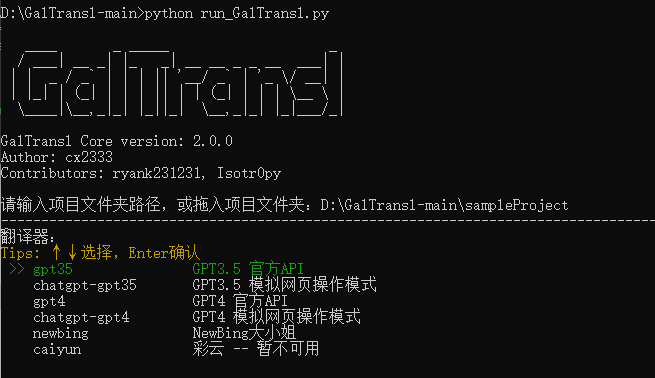
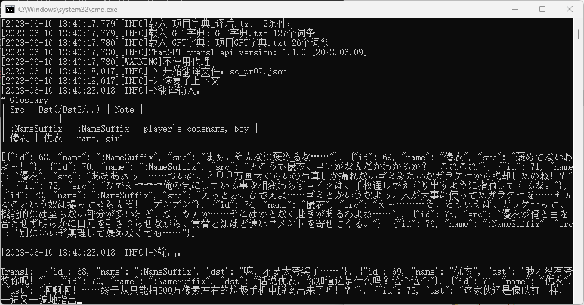

<div align=center></div>

<h1><p align='center' >GalTransl</p></h1>
<div align=center>      </div>
<p align='center' >Visual novel Automatic Translation Solution that Supports GPT3.5/4/Newbing</p>

  GalTransl is a set of **visual novel automatic translation tools** that combines several minor innovations in basic functions and the deep use of ChatGPT prompt engineering to create embedded translation patches. It is specifically designed for translating visual novels, so if you want to translate traditional novels or other types of games, it is recommended to switch to another programme.
   
  The core of GalTransl is a set of visual novel automatic translation scripts built by me (cx2333), which solves most of the known problems in using ChatGPT to automatically translate visual novel, and greatly improves the overall translation quality. At the same time, by combining with other projects, it connects the whole process of making patches, lowers the entry barrier to some extent, and allows friends who are interested in this to have the opportunity to build machine-translated patches with a certain quality with lower technical requirements, and (perhaps) try to efficiently build higher-quality patches on this basis.

  * Features：   
  1. Supports **ChatGPT, Newbing, GPT-4**, and Lingocloud four translation engines, and greatly improves the translation quality of GPT engines through prompt engineering.

  2. NewBing is based on GPT-4 and is **free**; ChatGPT and GPT-4 support official API and simulated web page operation mode, saving costs to some extent.

  3. The first **GPT dictionary system**, which allows GPT to understand the character setting, accurately translate names, pronouns and new words.

  4. The first NewBing, GPT-4 support **automatic recording of translation confidence, doubtful sentences, unknown proper nouns**, convenient for manual correction, and support automatic proofreading (not stable yet)
  
  5. Flexible automatic dictionary system based on pre-translation, post-translation dictionaries and conditional dictionaries.

  6. Real-time cache saving, automatic breakpoint continuation. 

  7. Combined with other projects to support one-click unpacking and injection of multi-engine scripts, provide complete tutorials to reduce the entry difficulty.

## Preface

* Code contribution: Thanks to ryank231231 and Isotr0py for improving my crappy code.
   
* Support me: Click a Star~ (Sharing patches for free is supporting me, it would be even better if you could mention that it was translated with GalTransl. PS. Please indicate GPT translation when sharing patches)

* Communication group: https://t.me/+xCypZf4DXmJjYzdl  

## Navigation
* [Environment preparation](https://github.com/XD2333/GalTransl#Environment_preparation)：Installation of environment and software.
* [Getting started tutorial](https://github.com/XD2333/GalTransl#Getting_started_tutorial)：A full process introduction on how to make a machine-translated patch, if you just want to see how to use this tool, you can just look at Part 2.
* [Translation engine introduction](https://github.com/XD2333/GalTransl#Translation_engine_introduction)：This article introduces the advantages and disadvantages of each translation engine and the recommended combination.
* [Configuration file and translation engine settings](https://github.com/XD2333/GalTransl#Configuration_file_and_translation_engine_settings)：This article details the calling and configuration of each translation engine API. 
* [GalTransl core function introduction](https://github.com/XD2333/GalTransl#GalTransl_core_function_introduction)：Introduce GPT dictionary, cache, ordinary dictionary, find problems and other functions.

## Environment preparation
  * Python   
  Install the latest version of Python. [Download](https://www.python.org/downloads/)   
  Download Check the box below to 'add Python to path' when installing.
   
  * [Download this project](https://github.com/XD2333/GalTransl/releases/)   
  Unzip it to any location, such as  `D:\GalTransl-main`.

  * Install Python dependencies  
 
    If you are a **beginner**, you can simply double-click `install dependencies.bat` to install the dependencies required by this project.

    If you are **familiar with python**, this project provides Poetry for dependency management, and you can install and run the program with the following commands:

  ```
  cmd
  pip install poetry
  poetry install
  cd GalTransl
  poetry shell
  python -m GalTransl -p Your project path -t Translation back-end
  ```


## Practical tools
| Name | Description |
| --- | --- |
| GalTransl_DumpInjector | Text tool：VNTextPatch gui |
| dbTXT2Json_jp | Text tool：Universal script for converting double-line text and json_jp |
| KirikiriTools | Engine tool: Krkr, krkrz dump, injection tool |
| UniversalInjectorFramework | Engine tool: Shift-JIS tunnel, Shift-JIS replacement mode universal injection framework |
| VNTextProxy | Engine tool: Shift-JIS tunnel mode universal injection framework |

## Getting started tutorial
The general process of making a visual novel embedded translation patch is:

1. Identify the engine -> unpack the resource pack to get the script -> go to 2.
2. Dump the script into original language text -> translate into target language text -> build the target script -> go to 3
3. Pack as resource pack/non-pack

I will divide it into 3 modules and explain it step by step. This paragraph is for those who have never done it before to have a chance to get started, and I will write more for the beginners.

* It is recommended to only run the translation of the first file, or just add some strings randomly, and return to the game to confirm that it can be displayed normally before translating all.
   
(Click to expand detailed instructions)   
<details>

<summary> <b> 

### Part 1 Identification and Unpacking   
</b> </summary>
Identifying the engine is actually very simple. Usually, using GARbro to open any resource pack in the game directory, the engine name will be displayed in the lower left corner of the status bar.

Or, refer to the [supported](https://morkt.github.io/GARbro/supported.html), and compare the suffixes of the resource packs.

Scripts are usually in some resource packs with obvious keywords, or in directories with obvious keywords in the resource packs, such as: scene, scenario, message, etc. And scripts are usually divided into obvious chapters and characters, some of which are also divided into main route and erotic (such as with _h), usually you can find them by looking through a few resource packs. 

Especially for the new krkrz engine, GARbro can no longer open the resource pack, you can use the [KrkrzExtract project](https://github.com/xmoezzz/KrkrzExtract/releases/tag/1.0.0.0), drag the game to the exe to start. Then download a full cg save, and skip all the plots directly, you can also get the script file.

</details>
<details>

<summary> <b> 

### Part 2 Extraction and Translation
</b> </summary>
* **【2.1. Extract script text】**   

Usually, this project is combined with [VNTextPatch tool](https://github.com/arcusmaximus/VNTranslationTools) to unpack the script. VNTextPatch is a universal tool developed by arcusmaximus that supports extraction and injection of scripts for [many engines](https://github.com/arcusmaximus/VNTranslationTools#vntextpatch).  (But not all these engines can be done, some games are tested to fail to extract)
   
VNTextPatch is operated using cmd. In order to reduce the difficulty of getting started, I made a graphical interface. You can find it in the useful_tools/GalTransl_DumpInjector folder of the project. Click GalTransl_DumpInjector.exe to run. 

Now, you only need to select the original script directory, and then select the directory where you want to save the extracted original json. Here we usually put the original script in a folder called script_jp, and then create a new json_jp directory to store the extracted script:  


Here, we need to clarify a concept: GalTransl uses JSON format for input, processing and output throughout. What is JSON Continue translating the following. The extracted json_jp file looks like this:

```json
[
  {
    "message": "わりと遠慮のない子らしい。でも、屈託のない明るさも\r\n相まってこういうのも悪くない。"
  },
  {
    "name": "咲來",
    "message": "「ってか、白鷺学園だったらあたしと一緒じゃん。\r\nセンパイだったんですねー」"
  }
]
```
Each {} object is a sentence, `message` is the message content, and if the object also has a `name`, it means it is a dialogue. However, it may not be possible to extract names for all types of scripts. When names can be extracted, the translation quality of GalTransl will be better.

PS. GalTransl only supports input of json files in a specified format, but that does not mean that GalTransl is bound to the VNTextPatch tool. You can completely extract the script text using other tools, and then try to use the “regular expression mode” to convert other formats of text and json text, but you need some regular expression experience. 


* **【2.2. GalTransl startup】**   
Download this project and unzip it to any location (the default is the root directory of D drive in the example), find the sample configuration file `config.inc.yaml` in the `sampleProject` folder of the project, and rename it to `config.yaml`. 

This tutorial uses GPT3.5 official API as an example. Other projects can refer to the following [engine usage]() section and modify the `config.yaml`of the sample project to call.

First, put all the extracted source script json files into the `json_jp` folder in `sampleProject`, and then use any text editor to edit the `config.yaml` file and modify the following contents according to the comments:

```yaml
proxy:
  enableProxy: false # Whether to enable proxy
  proxies:
    - address: socks5://127.0.0.1:10818 # Proxy address
backendSpecific:
  GPT35: # (GPT3.5 official API)
    tokens: # Token list
      - token: sk-xxxxxxxx # Yor token
        endpoint: https://api.openai.com  # This token corresponds to the endpoint of the OPENAI API request and needs to be modified when using forwarding or third-party APIs
      - token: sk-yyyyyyyy # Multiple tokens can be filled in, if you only have one, delete these two lines from the example file
        endpoint: ""
    defaultEndpoint: https://api.openai.com # Default API endpoint, generally unchanged
```   
You need an openai api key here, or you can try to build your own openai api forwarding.

If you don’t even have an api key, you can also use third-party api projects:
* Use [GPT-API-free project](https://github.com/chatanywhere/GPT_API_free), which is a third-party proxy for openai api, providing 120 free API requests per hour.
* Or [openai-sb project](https://openai-sb.com/), which is also a proxy project, with a reasonable price, this is not promotion, I do not guarantee its stability.

But note that the key obtained here is a third-party key, which cannot be used for the official API and my forwarding API endpoint.

```python
  enableProxy: false

  GPT35:
    tokens:
      - token: sk-xxxxxxxx # Your third-party token
        endpoint: https://api.chatanywhere.com.cn  # use third-party endpoint
```   
   
After modifying the project settings, make sure you have installed the required dependencies (see environment preparation), and then double-click `run.bat`, first enter or drag the project folder, such as `D:\GalTransl-main\sampleProject` and then select gpt35:



The program will start and start translating. 



**But** I don’t recommend you to start translating like this, you should at least take a look at the [use of GPT dictionary](https://github.com/XD2333/GalTransl#GPT_dictionary) first, and set up the name dictionary for each character of the visual novel you want to translate, so as to ensure the basic quality.

After the translation is completed, if you want to manually correct it, see the [translation cache section](https://github.com/XD2333/GalTransl#Translation_cache)

* **【2.3. Build target language script】**   

If you are using GalTransl extraction and injection tool to extract the script, build the same way, select the Japanese script directory, Chinese json directory, Chinese script save directory, and then click ‘inject’, you can inject the text back into the script. But there are some pitfalls here. 

Note: Here we generally call the original language script save directory script_cn, because the target language script directory is called script_jp.

</details>

<details>

<summary> <b> 

### Part 3 Pack or non-pack
</b> </summary>

After building the target language script, the next step is to find a way to make the game read it. First of all, the mainstream engines basically support free unpacking reading, you can see if the engine you want to work on supports non-packing reading. 

Especially for krkr/krkrz engine, you can use [KirikiriTools tool](https://github.com/arcusmaximus/KirikiriTools) by arcusmaximus, download the version.dll inside, throw it into the game directory, and then create a new “unencrypted” folder in the game directory, put the script in, and you can make krkr read it Part 4 Engine and Encoding.

</details>

<details>

<summary> <b> 

### Part 4  Engines and Encoding
</b> </summary>

GalTransl's VNTextPatch tool conveniently solves the problem of Chinese characters not being displayed in Shift-JIS encoded games. However, this is not a problem for English. So I won't explain it in detail here.

</details>


## Detailed introduction of engines  
This part introduces the advantages and disadvantages of each translation engine and the recommended combination. This article mainly introduces the advantages and disadvantages of the engines. For specific use, see the following part.  

<details>
<summary> <b>【Detailed introduction of engines】（Click to expand）</b> </summary>

* **NewBing**:+1::+1::+1:   
NewBing is Microsoft’s Bing ai assistant, which is based on [GPT-4](https://blogs.bing.com/search/march_2023/Confirmed-the-new-Bing-runs-on-OpenAI%E2%80%99s-GPT-4), and is free of charge. It is the LLM I recommend when you want to create high-quality translation.
   
  * Advantages:   
  ✔ **Free GPT-4**   
  ✔ High-quality context analysis and ability to maintain the original style
  ✔ Supports **automatically giving translation confidence** for each sentence, convenient for manual proofreading  
  ✔ When the confidence is low, supports automatically recording **the segments that it thinks are doubtful**, convenient for manual proofreading
  ✔ Supports automatically recording the **proper nouns that it does not recognize**, convenient for manual proofreading   
  ✔ Supports **automatic proofreading and polishing** of the initial translation   
   
  * Disadvantages：  
  🔞 **Erotic is not allowed**，can only be used for non-erotic content，need to be combined with other engines
  ❔ Currently 200 questions per account per 24 hours 
  🚸 Slow speed, if automatic proofreading is enabled, it will be slower  
  ❔ Currently automatic proofreading is not stable  
    
  * Summary: It is very strong, but it runs in teenager mode (I'm sorry but I prefer not to continue this conversation🙏)
  ---   
* **ChatGPT**:+1::+1:   
The currently popular OpenAI’s large language model, model code name is gpt-3.5-turbo, also known as GPT-3.5. This project provides two ways to call ChatGPT, through the official api and simulated web page operation, optimizes token usage, and improves translation quality through prompt engineering, and removes erotic restrictions.  
   
  * Advantages:
  ✔ Erotic unlocked, ~~very good at erotic~~
  ✔ Translation quality is weaker than GPT4, but still beats old-fashioned machine translation under the optimization of prompt engineering.  
     
  * Disadvantages：  
  🫰 Requires a certain cost, can save some by buying key, buying api proxy, using simulated web page mode (API cost is about 5 dollars quota to translate 600k-700k words)  
  🚩 If using simulated web page operation mode, **may be banned** (there are many factors for banning, mainly using virtual cards)  
  ❔ Often loses line breaks, occasionally leaves original text, strays lines, over-brain supplements, logic confusion, can be solved by finding problem system 
  👎 **Does not support** automatic proofreading, providing confidence, recording doubtful segments and unknown nouns, seems to have exceeded its ability limit  
    
  * Summary: Speed and price are acceptable, enough to make a nukige work. It has tried very hard, but it is not very smart. 
  ---   
* **GPT-4**:+1:  
The currently popular OpenAI’s `state-of-the-art` large language model, model code name is GPT-4. This project provides two ways to call GPT-4, through the official API and simulated web page operation, optimizes token usage, and removes lewdness restrictions through prompt engineering.  
  
  * Advantages:
  ✔ *Erotic unlocked*（
  ✔ Other features same as NewBing
   
  * Disadvantages：  
  🫰 Expensive, not recommended to use
  🚸 Slow speed, currently 200 questions per account per 24 hours
  🚩 Simulated web page operation mode is reverse engineered from web version of GPT4, **may be banned**(there are many factors for banning, mainly using virtual cards)   

  * Summary: Hard to afford it. If you love it enough to buy one together. Don’t use official API, can’t afford it.  
  ---   
* **Lingocloud**   
  Lingocloud api，traditional machine translation，This project has been written intermittently for more than two years. Most of the time it was based on this engine to build cloud translation patches.
     
  * Advantages:   
  ✔ Fast translation, 30 sentences at a time  
  ✔ Free quota
  ✔ Quality acceptable   
     
  * Disadvantages：   
  👀 Special content often mis-translated or wrong-translated. Sentences are not smooth 
  

</details>

## GalTransl core function introduction
GalTransl core function introduction Introduce GPT dictionary, cache, ordinary dictionary, find problems and other functions.
(Click to expand detailed instructions)
<details>

<summary>   
   
### GPT dictionary
GPT dictionary system is a key function to improve the quality of translation when using GPT. It greatly improves the translation quality by supplementing the settings. It is suitable for chatgpt, newbing, gpt4.   
   
</summary>   

* For example, you can pre-define the target language translation of each character name here, and explain the character’s setting, such as gender, approximate age, occupation, etc. By automatically feeding GPT these settings, you can automatically adjust the appropriate pronouns he/she, titles, etc., and fix the target language translation of the name when it is in kana.
* Or, you can supplement some words that it always translates incorrectly here. If you provide some explanation, it will understand better.
   
---   
   
* Learn how to use GPT dictionary to feed character settings through the following example. The format of each line is `Source Language[Tab]target language[Tab]Explanation(optional)`, note that the connector in the middle is **TAB**   
```
フラン	Flan	name, lady, teacher
笠間	Kasama	笠間 陽菜乃’s lastname, girl
陽菜乃	Hinano	笠間 陽菜乃's firstname, girl
瞬	Shun	player's name, boy
$str20	$str20	player's codename, boy
```
These are a few dictionary entries that are used to define characters:
  
* The first one can be understood as I want to tell GPT: “The translation of the kana フラン is Flan, this is a name, a lady, a teacher”. This way GPT will translate フラン先生 as Flan teacher instead of Flan doctor.
* The second and third ones are the Japanese surname and given name of the same person, and testing shows that the name must be written in two lines, otherwise GPT3.5 will not recognize it.
* The fourth one is the recommended way to write the **protagonist’s name**.
* The fifth one is how to write the male protagonist when using a placeholder instead of a name in the script. 

---   
   
* Learn how to use GPT dictionary to feed new words through the example below, the format of each line is also `original text[Tab]translation[Tab]description(optional)`, note that the connector in the middle is **TAB** 
```
大家さん  landlord
あたし	I/ic	use 'ic' when being cute
```
* When you find that GPT doesn't know this word very well, such as "大家さん", and this word has a relatively unique meaning, then you can add it to the general GPT dictionary like this, explanation is not necessary.  
* The second line of target language wrote a polysemous word "I/ic", and in the explanation wrote "use 'ic' when being cute". GPT3.5 is not that smart, but GPT4 can basically use it flexibly according to the explanation.

* Want to make GPT more pornographic? Add your own dictionary ( 

In the program directory, there is a "General GPT Dictionary.txt" in the `Dict` folder, and there will be a "Project GPT Dictionary.txt" in the `sampleProject` folder. Generally, name definitions are written in the project dictionary, and common words that improve the translation quality are written in the general dictionary.
You don't have to worry about the dictionary being too large and causing side effects, only when the name and sentence sent to GPT this time have this word, will this word's explanation be sent into this round of conversation. Also don't add everything to it, ~~adding everything will only harm you~~, it is recommended to only write **the settings of each character** and **words that are always translated wrong**.

The dictionary will be dynamically displayed in each request when running:


</details>   
   
<details>

<summary>   

### Ordinary dictionary
In GalTransl, ordinary dictionary is divided into “pre-translation dictionary” and “post-translation dictionary”. Pre-translation dictionary is a to b replacement processing of original script before translation, and post-translation dictionary is a to b replacement processing of translated script after translation.  

</summary>   

What is the use of pre-translation dictionary? Here I share a small trick for traditional machine translation engines.
```txt
When using traditional machine translation engines, one solution for the situation of random translation of names is: Before translating, replace the name with a name that will definitely not be translated randomly. For example, I usually replace the male protagonist directly with 'Zhang San', and Colorful Clouds Translator will never translate this name wrong. Then in the post-translation dictionary, replace Zhang San back to the original target language name of the male protagonist, This achieves the effect of letting traditional machine translation engines translate names stably. The same applies to female protagonists. 

```
But since the GPT era has the GPT dictionary system, this trick is basically useless. Now pre-translation dictionary is mostly used for some unclear correction situations, and if multiple words represent the same meaning, you can use pre-translation dictionary to unify them first.   
   
Post-dictionary is a more common dictionary, which replaces a word with another word after translation, but here I improved something called "conditional dictionary". Conditional dictionary is actually just adding a step of judgment before replacing, to avoid misreplacement, overreplacement and other situations.
Each line format is `pre_jp/post_jp[tab]judgment word[tab]search word[tab]replacement word`
* pre_jp/post_jp indicates the position where the judgment word is searched, defined in the section "translation cache"
* Judgment word: If the judgment word is found in the search position, the replacement behind it will be activated.
* Judgment word can be prefixed with "!" to mean "replace if not present", otherwise it usually means "replace if present".
* Judgment word can use `[or]` or `[and]` keywords to connect, multiple `[or]` connections mean "enter replacement if one condition is satisfied", multiple `[and]` connections mean "enter replacement if all conditions are satisfied" 

</details>

<details>

<summary>   

### Translation cache
After starting the translation, you can find the translation cache in the transl_cache directory.
</summary>  

The translation cache corresponds to json_jp one by one. During the translation process, the translation result will be written to the cache first. When a file is translated, it will appear in json_cn.

First, summarize some points:
1. When you want to re-translate a sentence, open the corresponding translation cache file and delete the whole line of pre_zh for that sentence (**do not leave a blank line**)
2. When you want to re-translate a whole paragraph, just delete the corresponding number of object blocks. When you want to re-translate a file, just delete the corresponding translation cache file.
3. When GalTransl is translating, do not modify the cache of the file being translated. It will be overwritten anyway.
4. json_cn result file = pre_zh/proofread_zh in translation cache + post-translation dictionary replacement + restore dialogue box
5. When the new post_jp is inconsistent with the post_jp in the cache, it will trigger re-translation, which usually happens when a new pre-translation dictionary is added

Below is a typical example of translation cache:

```json
    {
        "index": 4,
        "name": "",
        "pre_jp": "欠品していたコーヒー豆を受け取ったまでは良かったが、\r\n帰り道を歩いていると汗が吹き出してくる。",
        "post_jp": "欠品していたコーヒー豆を受け取ったまでは良かったが、\r\n帰り道を歩いていると汗が吹き出してくる。",
        "pre_zh": "领取了缺货的咖啡豆还好，\r\n但是走在回去的路上就汗流浃背了。",
        "proofread_zh": "领了缺货的咖啡豆倒是没问题，\r\n可是走在回去的路上，汗水就冒了出来。",
        "trans_by": "NewBing",
        "proofread_by": "NewBing",
        "trans_conf": 0.94,
        "doub_content": [
            "汗流浃背"
        ]
    },
```
Explain the meaning of each field:

* Basic parameters:
 
  `index`  index serial number
  
  `name`  name
  
  `pre_jp`  original script
  
  `post_jp`  processed script. Generally speaking, post_jp = pre_jp remove dialogue box + pre-translation dictionary replacement.
  
  `pre_zh`  translated script
  
  `proofread_zh`  proofread script

There is no post_zh, post_zh is in json_cn.

* Extended parameters:
  
  `trans_by`  translation engine/translator 
  
  `proofread_by`  proofreading engine/proofreader 
  
  `trans_conf`  translation confidence, only NewBing, GPT4 support, the fourth sentence 0.94 means that NewBing has 94% confidence in the accuracy of this sentence.
  
  `doub_content`  doubtful content, only NewBing, GPT4 support, representing the place where the translation engine thinks the translation may be inaccurate.
  
  `unknown_proper_noun`  unknown proper noun, only NewBing, GPT4 support, convenient for later manual correction problem store problem.
  
  `problem`  See below for automatic error finding.
  
  `post_zh_preview`  post_zh_preview for previewing json_cn, but modifying it will not apply to json_cn, you need to modify `pre_jp/proofread_zh`.

* After determining the content that needs to be modified, directly modify the `pre_zh` or `proofread_zh` of the corresponding sentence, and then rerun the program to generate a new json_cn.

  
</details>

<details>

<summary>   

### Automatic error finding

GalTransl has built a system of automatically finding problems based on rules based on long-term observation of translation results.

</summary>  
The error finding system is enabled in the `config.yaml` of each project. The default configuration is like this.

```yaml
# error finding system config
problemAnalyze:
  GPT35: # GPT35 / ChatGPT
    - 词频过高
    - 标点错漏
    - 残留日文
    - 丢失换行
    - 多加换行
    - 比日文长
  arinashiDict:
    # 格式为 aaa:<空格>bbb
    aaa: bbb
    ccc: ddd
```

Currently supports finding the following problems, put the problem name in the corresponding translation engine according to the example to activate, delete to disable:

* 词频过高：If a word or symbol is repeated more than 20 times, it will trigger, used to find possible mis-translation situations. 
* 标点错漏：Find the addition or omission of symbols such as parentheses, quotation marks, colons, etc. 
* 残留日文：There is still Japanese left after translation. 
* 丢失换行：Lost the original line break (\r\n) after translation Added line break
* 多加换行：Over-brain supplement, added a line break by itself. 
* 比日文长：Generally speaking, target language has more information than Japanese. So if a sentence is obviously longer than Japanese after translation, it means that the translation of this sentence may have strayed (the translation of the previous or next sentence strayed to this sentence). It will be recorded in problem as “x times longer than Japanese”. 
* 彩云不识：Only for Lingocloud Translator. Lingocloud Translator will translate words that it has never seen before into something.

arinashi_dict is a problem finding dictionary that can customize rules. The configuration format is
```
    # The configuration format is aaa:<space>bbb
    aaa: bbb
    ccc: ddd
```
After setting, the program will look for two situations: `there is aaa in original, but no bbb in the translation`, and `there is no aaa in original, but bbb in the translation`. It is generally used to check whether some proper nouns have been translated correctly.

After finding the problem, it will be stored in the translation cache, see the translation cache section. Use Emeditor to batch extract the problem keyword and you can see all the current problems, and correct the problem by modifying the pre_jp in the cache.

</details> 

## Configuration file and translation engine settings

<details>

<summary>  
This part introduces the configuration of calling various translation engine APIs.
</summary>  
   
   
* **Common configuration**   
```yaml
---
# Common settings
common:
  loggingLevel: info # Basic configuration Log level, optional [debug/info/warning/error]
  multiThread: false # Multithreading. [True/False]（not available yet）
  # common
  sourceLanguage: ja # Source language. [zh-cn/zh-tw/en/ja/ko/ru/fr]
  targetLanguage: zh-cn # Target language. [zh-cn/zh-tw/en/ja/ko/ru/fr]
  retranslFail: false # After starting, re-translate sentences that NewBing refused to translate. [True/False]
  gpt.numPerRequestTranslate: 9 # Number of sentences to translate at a time, not recommended to be too large
  gpt.streamOutputMode: true # Stream output/typewriter effect, turn on to facilitate observation of the process, turn off to facilitate observation of the result. [True/False]
  # NewBing/GPT4
  gpt.enableProofRead: false # (NewBing/GPT4)Whether to enable post-translation proofreading. [True/False]
  gpt.numPerRequestProofRead: 7 # (NewBing/GPT4) Number of sentences to proofread at a time, not recommended to modify
  gpt.recordConfidence: true # (GPT4)Record confidence, doubtful sentences, GPT4 official API suggest turn off to save tokens. [True/False]
  gpt.forceNewBingHs: false # (NewBing)Force NewBing to translate erotic, causing the speed to become very slow and may be more likely to be banned. [True/False]
  # GPT3.5/GPT4
  gpt.translStyle: auto # (GPT3.5/4 official API) GPT parameter preset, precise more accurate normal more random, auto automatically switch. [auto/precise/normal]
  gpt.degradeBackend: false # (GPT3.5/4 official API) Whether to use GPT4’s key for GPT3.5’s request. [True/False]
  gpt.restoreContextMode: true # (GPT3.5/4 official API) Restore the previous context when restarting. [True/False]
  gpt.fullContextMode: false # (GPT3.5/4 official API) Keep more context. Turn on to improve effect, turn off to save several times token consumption. [True/False]
  gpt.lineBreaksImprovementMode: false # (GPT3.5) Line break improvement mode, reduce the loss of line breaks, but may cause loop retry. [True/False]
# Proxy
proxy:
  enableProxy: false # Whether to enable dictionary. [True/False]
  proxies:
    - address: http://127.0.0.1:7890
      # username: foo
      # password: bar
# Dictionary
dictionary:
  defaultDictFolder: Dict # General dictionary folder, relative to program directory
  # pre-translation dictionary
  preDict:
    - 00通用字典_译前.txt
    - 01H字典_矫正_译前.txt  # For unclear correction
    - (project_dir)项目字典_译前.txt # (project_dir) means dictionary in project folder
  # GPT dictionary
  gpt.dict:
    - GPT字典.txt
    - (project_dir)项目GPT字典.txt
  # post-translation dictionary
  postDict:
    - 00通用字典_符号_译后.txt # Symbol correction
    - 00通用字典_译后.txt
    - (project_dir)项目字典_译后.txt
```


* **NewBing**   
You need a Microsoft account. Then download the [EditThisCookie extension](https://chrome.google.com/webstore/detail/editthiscookie/fngmhnnpilhplaeedifhccceomclgfbg)
Visit https://www.bing.com/ , log in and click the EditThisCookie icon, click "Export Cookies",
Then create a new `newbing_cookies` folder in the sample project folder, then create a txt file inside it, name it whatever you want, and paste the content you get from clicking Export Cookies and save it.

Modify the following configuration in the configuration file:

```yaml
  bingGPT4:
    cookiePath:
      - newbing_cookies/cookie1.txt # Your cookies file1
      - newbing_cookies/cookie2.json # Your cookies file2, the suffix doesn't affect the programme's ability to read it
```
You can write multiple files under cookiePath according to the example. When an account reaches the limit, it will switch to the next account.

> Enable proofreading mode:
Set `gpt.enableProofRead: true`, after translating a json, it will start to automatically polish this json

> For the situation where newbing refuses to translate, a recommended trick is to set `gpt.numPerRequestTranslate` to 9 or 12 first, translate it once, then set `retranslFail` to True, set `gpt.numPerRequestTranslate` to 3, and run it again. The rest are the ones that newbing will never translate, switch engines. 
> Also, if the script has separated erotic, you can create a separate project folder for erotic translation, and merge json_jp and transl_cache after translation.

* **ChatGPT**   
Official API call method, see getting started tutorial  

When using simulated web page operation mode, log in to web version account and visit https://chat.openai.com/api/auth/session

Copy the long string of content inside the double quotes after “accessToken”:, copy it to the configuration, and then select Chatgpt-gpt35 engine when calling
```yaml
  ChatGPT: # ChatGPT / GPT3.5(4) not official API, simulate web operations
    access_tokens:
      - access_token: xxx # Paste the accessToken here
```

* **GPT-4**   
GPT-4 For official API call method, see getting started tutorial, fill in api key in GPT4:  `# GPT4 official API`

When using simulated web page operation mode, log in to web version account and visit https://chat.openai.com/api/auth/session

Copy the long string of content inside the double quotes after “accessToken”:, copy it to the configuration, and then select Chatgpt-gpt4 engine when calling

```yaml
  ChatGPT: # ChatGPT / GPT3.5(4) not official API, simulate web operations
    access_tokens:
      - access_token: xxx # Paste the accessToken here
```

> Enable proofreading mode:   
Set ` gpt.enableProofRead: true`, after translating a json, it will start to automatically polish this json


</details>


